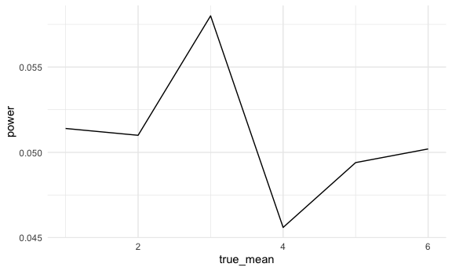
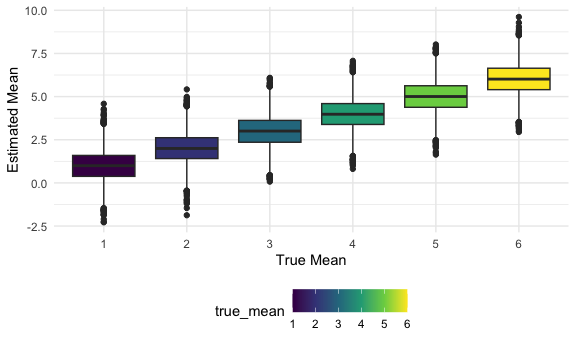
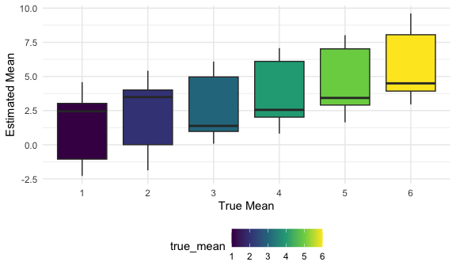
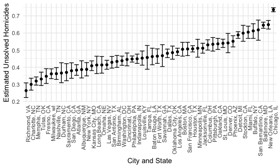

p8105_hw5_scs2267.Rmd
================
2024-11-15

``` r
library(tidyverse)
```

    ## ── Attaching core tidyverse packages ──────────────────────── tidyverse 2.0.0 ──
    ## ✔ dplyr     1.1.4     ✔ readr     2.1.5
    ## ✔ forcats   1.0.0     ✔ stringr   1.5.1
    ## ✔ ggplot2   3.5.1     ✔ tibble    3.2.1
    ## ✔ lubridate 1.9.3     ✔ tidyr     1.3.1
    ## ✔ purrr     1.0.2     
    ## ── Conflicts ────────────────────────────────────────── tidyverse_conflicts() ──
    ## ✖ dplyr::filter() masks stats::filter()
    ## ✖ dplyr::lag()    masks stats::lag()
    ## ℹ Use the conflicted package (<http://conflicted.r-lib.org/>) to force all conflicts to become errors

``` r
library(readr)
set.seed(1)
```

# Problem 1

``` r
bday_sim = function(n) {

  bdays = sample(1:365, size = n, replace = TRUE)
  
  duplicate = length(unique(bdays)) < n

  return(duplicate)
  
}

bday_sim(10)
```

    ## [1] FALSE

# Problem 2

## Mean of Zero

``` r
sim_mean_sd = function(n = 30, mu, sd = 5) {
  
sim_data = rnorm(n, mu, sd)
  
test = t.test(sim_data, y=NULL, alternative = c("two.sided"), mu = mu) %>% broom::tidy() %>% 
  janitor::clean_names() %>% 
  select(p_value, estimate)
  
  out_df = tibble(
    true_mean = mu,
    p_value = test$p_value,
    e_mean = test$estimate
  )
  
  return(out_df)
}
```

``` r
output = vector("list", 5000)

for (i in 1:5000) {
  
  output[[i]] = sim_mean_sd(30, 0, 5)
  
}

sim_results = bind_rows(output)
```

## Means 1-6

``` r
sim_res = 
  expand_grid(
    mu = c(1, 2, 3, 4, 5, 6),
    iter = 1:5000
  ) %>%  
  mutate(samp_res = map(mu, \(x) sim_mean_sd(n = 30, x, sd = 5))) %>%  
  unnest(samp_res) %>% 
  select(true_mean, p_value, e_mean)
```

## Plot 1

``` r
power_results = sim_res %>%
  group_by(true_mean) %>% 
  summarize(
    power = mean(p_value < 0.05)
  )
power_results %>% 
  ggplot(aes(x = true_mean, y = power))+
  geom_line()
```


It appears that the effect size decreases for true means 1-3, increases
from true means 3-4, decreases from true means 4-5, and increases from
true means 5-6. There does not seem to be a consistent trend in power in
relation to the true mean.

## Plot 2

``` r
sim_res %>% 
  group_by(true_mean) %>% 
  ggplot(aes(x = as.factor(true_mean), y = e_mean, fill = true_mean))+
  geom_boxplot()+
  labs(
    x = "True Mean",
    y = "Estimated Mean"
  )
```



## Plot 3

``` r
sim_res %>% 
  filter(p_value<0.05) %>% 
  group_by(true_mean) %>% 
  ggplot(aes(x = as.factor(true_mean), y = e_mean, fill = true_mean))+
  geom_boxplot()+
  labs(
    x = "True Mean",
    y = "Estimated Mean"
  )
```



Most of the sample averages of mu across tests for which the null is
rejected are not equal to the true mean. This is because rejecting the
null indicates that there is evidence of a statistically significant
difference between the estimate and the true mean. Therefore, the sample
averages for which the null hypothesis is rejected are not equal to the
true means because these averages are more extreme than the null
threshold, and therefore it is less likely that the average is equal to
the true mean.

# Problem 3

The homocide dataset contains information for all fifty states on the
date of each homocide, the names of the victims, the victims race, age
and sex, the city and state where the homocide occured, the latitude and
longitude, and the disposition. There are 52,179 observations in the raw
dataset.

``` r
homocide_df = read_csv("./data/homicide-data.csv")%>% 
 mutate(
   city_state = paste(city, state, sep = ", "),
   case_status = if_else(disposition == "Closed without arrest"|disposition == "Open/No arrest", "unsolved", "solved")
 ) 
```

    ## Rows: 52179 Columns: 12
    ## ── Column specification ────────────────────────────────────────────────────────
    ## Delimiter: ","
    ## chr (9): uid, victim_last, victim_first, victim_race, victim_age, victim_sex...
    ## dbl (3): reported_date, lat, lon
    ## 
    ## ℹ Use `spec()` to retrieve the full column specification for this data.
    ## ℹ Specify the column types or set `show_col_types = FALSE` to quiet this message.

``` r
total_df = homocide_df %>% 
  group_by(city_state) %>% 
  summarize(
    total_homocide = n(),
  )

unsolved_df = homocide_df %>%
  filter(case_status == "unsolved") %>% 
  group_by(city_state) %>% 
  summarize(
    total_unsolved = n(),
  )

proportion_test = left_join(total_df, unsolved_df, by = "city_state") %>% 
   drop_na()
```

## Prop Test for Baltimore

``` r
bal_data = proportion_test %>% 
  filter(city_state == "Baltimore, MD")

test = prop.test(
  x = bal_data$total_unsolved, 
  n = bal_data$total_homocide, 
  p = NULL, 
  alternative = c("two.sided"), 
  conf.level = 0.95) %>% 
  broom::tidy(test)

test %>% 
  janitor::clean_names() %>% 
  select(estimate, conf_low, conf_high) %>% 
  knitr::kable()
```

|  estimate |  conf_low | conf_high |
|----------:|----------:|----------:|
| 0.6455607 | 0.6275625 | 0.6631599 |

## Prop test for all cities

``` r
proportion_func = function(x, y){
  test = prop.test(
  x = x, 
  n = y, 
  p = NULL, 
  alternative = c("two.sided"), 
  conf.level = 0.95) %>% 
  broom::tidy()
  
  return(test)
}

unsolved_homocide = proportion_test %>% 
    mutate(
      output = purrr::map2(
        total_unsolved,
        total_homocide,
        ~proportion_func(x = .x, y = .y))) %>% 
    unnest(output) %>% 
    janitor::clean_names() %>% 
    select(city_state, estimate, conf_low, conf_high)

unsolved_homocide %>% 
  knitr::kable()
```

| city_state         |  estimate |  conf_low | conf_high |
|:-------------------|----------:|----------:|----------:|
| Albuquerque, NM    | 0.3862434 | 0.3372604 | 0.4375766 |
| Atlanta, GA        | 0.3833505 | 0.3528119 | 0.4148219 |
| Baltimore, MD      | 0.6455607 | 0.6275625 | 0.6631599 |
| Baton Rouge, LA    | 0.4622642 | 0.4141987 | 0.5110240 |
| Birmingham, AL     | 0.4337500 | 0.3991889 | 0.4689557 |
| Boston, MA         | 0.5048860 | 0.4646219 | 0.5450881 |
| Buffalo, NY        | 0.6122841 | 0.5687990 | 0.6540879 |
| Charlotte, NC      | 0.2998544 | 0.2660820 | 0.3358999 |
| Chicago, IL        | 0.7358627 | 0.7239959 | 0.7473998 |
| Cincinnati, OH     | 0.4452450 | 0.4079606 | 0.4831439 |
| Columbus, OH       | 0.5304428 | 0.5002167 | 0.5604506 |
| Dallas, TX         | 0.4811742 | 0.4561942 | 0.5062475 |
| Denver, CO         | 0.5416667 | 0.4846098 | 0.5976807 |
| Detroit, MI        | 0.5883287 | 0.5687903 | 0.6075953 |
| Durham, NC         | 0.3659420 | 0.3095874 | 0.4260936 |
| Fort Worth, TX     | 0.4644809 | 0.4222542 | 0.5072119 |
| Fresno, CA         | 0.3470226 | 0.3051013 | 0.3913963 |
| Houston, TX        | 0.5074779 | 0.4892447 | 0.5256914 |
| Indianapolis, IN   | 0.4493192 | 0.4223156 | 0.4766207 |
| Jacksonville, FL   | 0.5111301 | 0.4820460 | 0.5401402 |
| Kansas City, MO    | 0.4084034 | 0.3803996 | 0.4370054 |
| Las Vegas, NV      | 0.4141926 | 0.3881284 | 0.4407395 |
| Long Beach, CA     | 0.4126984 | 0.3629026 | 0.4642973 |
| Los Angeles, CA    | 0.4900310 | 0.4692208 | 0.5108754 |
| Louisville, KY     | 0.4531250 | 0.4120609 | 0.4948235 |
| Memphis, TN        | 0.3190225 | 0.2957047 | 0.3432691 |
| Miami, FL          | 0.6048387 | 0.5685783 | 0.6400015 |
| Milwaukee, wI      | 0.3614350 | 0.3333172 | 0.3905194 |
| Minneapolis, MN    | 0.5109290 | 0.4585150 | 0.5631099 |
| Nashville, TN      | 0.3624511 | 0.3285592 | 0.3977401 |
| New Orleans, LA    | 0.6485356 | 0.6231048 | 0.6731615 |
| New York, NY       | 0.3875598 | 0.3494421 | 0.4270755 |
| Oakland, CA        | 0.5364308 | 0.5040588 | 0.5685037 |
| Oklahoma City, OK  | 0.4851190 | 0.4467861 | 0.5236245 |
| Omaha, NE          | 0.4132029 | 0.3653146 | 0.4627477 |
| Philadelphia, PA   | 0.4478103 | 0.4300380 | 0.4657157 |
| Phoenix, AZ        | 0.5514223 | 0.5184825 | 0.5839244 |
| Pittsburgh, PA     | 0.5340729 | 0.4942706 | 0.5734545 |
| Richmond, VA       | 0.2634033 | 0.2228571 | 0.3082658 |
| Sacramento, CA     | 0.3696809 | 0.3211559 | 0.4209131 |
| San Antonio, TX    | 0.4285714 | 0.3947772 | 0.4630331 |
| San Bernardino, CA | 0.6181818 | 0.5576628 | 0.6753422 |
| San Diego, CA      | 0.3796095 | 0.3354259 | 0.4258315 |
| San Francisco, CA  | 0.5067873 | 0.4680516 | 0.5454433 |
| Savannah, GA       | 0.4674797 | 0.4041252 | 0.5318665 |
| St. Louis, MO      | 0.5396541 | 0.5154369 | 0.5636879 |
| Stockton, CA       | 0.5990991 | 0.5517145 | 0.6447418 |
| Tampa, FL          | 0.4567308 | 0.3881009 | 0.5269851 |
| Tulsa, OK          | 0.3310463 | 0.2932349 | 0.3711192 |
| Washington, DC     | 0.4379182 | 0.4112495 | 0.4649455 |

## Plot for Estimates and Confidence Interavals

``` r
unsolved_homocide %>% 
  mutate(city_state = fct_reorder(city_state, estimate)) %>% 
  ggplot(aes(x = city_state, y = estimate))+
  geom_point()+
  theme(axis.text.x = element_text(angle = 90, hjust = 1))+
  geom_errorbar(aes(ymin = conf_low, ymax = conf_high))+
   labs(
    x = "City and State",
    y = "Estimated Unsolved Homicides"
  )
```


